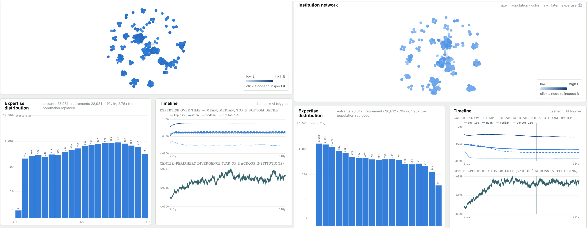
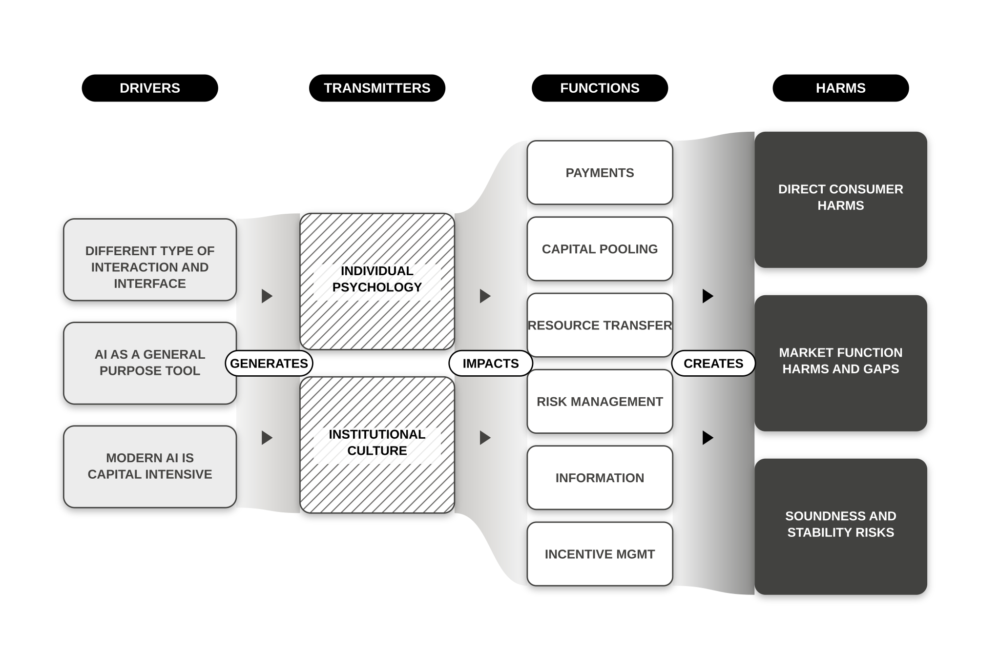

# Capability Decay Simulator

.

## Quick start.

An Agent-based model of institutions and humans where reliance on AI erodes the
real expertise (`E`) behind their output over time.

You will need to download this repository and then you do the following:

- See [simulator.html](https://sgt101.github.io/capability-decay-simulator/) for the interactive visualizer.

- Run the experiments "src/run_experiments.sh --workers 14"

- Run "node src/build_report.js" and you can then browse [report.html](report.html) to review your results
  d
  See [machine_generated.md](machine_generated.md) for an (mostly AI) generated set of more detailed instructions for setting up and running batch experiements.

Running the batchs takes about 1hr 40 on a MBP-5 with 48GB ram, and you will need a few GB of disk free as the results files are quite big.

## Background

.
Figure 1. A visualisation of a risk propagation model of a financial system. On the LHS causal factors impact on human psychology and insitutional culture, changes in behaviour and capability (positive or negative) then propagate into the functions of the finacial system resulting in the potential creation of harm RHS[^†]

The question that motivated the development of this simulation was "what significant harms could arise from the deployment of modern AI by actors in the Financial system". A significant harm is considered as something that would create political pressure, for example the kind of harm to an individual or small group that would make them the focus of national attention (think - [https://en.wikipedia.org/wiki/British_Post_Office_scandal](subpost masters) in the uk) or create widespread economic damage that might not be grievous for an individual but is noticable at regional, national or super national levels (for example the [https://en.wikipedia.org/wiki/2008_financial_crisis](GFC)).

There are a lot of different ways that risks to the system could be created, (systematic technical errors, concentration, loss of market oversight, sovereign, political, misalignment, cyber, fraud,...) but psychological and cultural mechanisms are the focus of this work.

This focus motivated an analysis of different psychological, cultural and insitutional dynamics that could create significant risks (see Figure 1) by propagating from individuals and insitutions through the fundamental functions of the system (we chose the well known {Bodie and Merton 98} framework).

One of these risk factors is the potential for AI to impede human learning, particularly the acquisition of expertise. The assumption is that expertise is required by the financial system both during it's normal functioning to create maximal efficiency (getting as close to market efficiency as non-rational agents might) but also to effectively manage crisis situations. If the system fails in a crisis and (for example) the payments system collapses because there was insufficient expertise to shape an effective set of mitigations significant harm will clearly accrue (people die, the economy collapses, chaos reigns...).

This simulation models how AI might impact the development and transmission of expertise. There are a bunch of caveats about its validity and working but it's now at a point where it produces interesting behaviours and so it's time to share it.

## Model

Imagine a network of financial services insitutions within which agents acquire expertise from each other and individually over time. Agents and expertise propagate across the network mediated by insitutional sector similarity and city/hub residence. Insitutional capability is determined by the level of AI that is available in the system and the expertise and number of agents that are affiliated to an insitution.

### Dynamics

Agents within the network use AI (the insitutional capability created) in line with the (plausible, peer reviewed, but far from definitive) theory of "The Jagged Frontier..." [Dell'Acqua et-al 2023/2026]. In the absence of AI agents gradually acquire experise up to their intrinsic level of capability, but are accelerated or constrained by the expertise around them.

The basic idea of the model is that expertise grows in the presence of other experts, so in each insitution the most senior top_n staff set an expertise target which all other agents grow towards at an accelerated rate (β).

Once agents pass the expertise ceiling in their insitution they can continue to grow at an ambient rate (μ_p). However there is a global decay function so agents that are at low expertise nodes experience slow decay (δ).

Agents are rated for a transfer out of their insitution vs a pressure metric and a prestige metric. The idea being that agents are faced with competition internally and can see that there might be an opportunity to go to another presegious place where there is less expertise and less pressure. Essentially this is a job market dynamic and distributes high expertise accross the network over time.

In the presence of AI (λ) a mechanism, in line with the effects reported in Stromberg et-al 2026 and others, is used to differentially surpress or amplify learning speed for agents in the different populations with expertise below (γ_below) or above (γ_above) the level of AI simulated. The idea is that agents with different expertise levels would get different results by using an AI that is less or more capable than they are, in particular that an agent which is less capable may experience fewer opportunities for learning because they simply use an AI rather than expand their knowledge. The simulator does not impose this view, however, instead the parameter is represented by a value -1 to +1 which can be selected. Under the hood this is actually selecting over a co-efficient from 0.0 (complete learning surpression) to 2.0 (learning amplifed 2x speed).

An average agent is maintained in the population for 480 time ticks simultating a 40 year working life. Every year insitutions recieve an intake of new agents in proportion to their scale. These agents are introduced at a mean expertise level of α_E, which is typically set low simulating the entry of naive finance graduates to the workforce. A parameter c_learning_cap is used to surpress learning early in a career ensuring that a certain number of years is required to breach the insitutional expertise threshold.

### Graph

Two graphs were developed to represent the overal system of insitutions.

A BA-Graph (Albert and Barabasi 2002) is generated synthetically and agents are allocated to nodes according the the mechanics of generation.

A data driven graph is created using the data in [data\world-model.json](data\world-model.json). The data in this graph is a result of estimates and internet scrapes with AI; it should in no way be treated as canonical, but instead is an attempt to describe the modern financial system.

## Tools

Two types of tool are provided to explore and use the simuation.

- [src\similator.html](src\simulator.html) : this is an interactive html page that you can open as a file on your file system when you download the repo or open at [[sgt101.github.io/capability-decay-simulator](https://sgt101.github.io/capability-decay-simulator/)

[^†]: I would like to thank and acknowledge Andrew Sutton, Martin Rusch, and other colleagues and collaborators in the "Chapter 2 working group" for their identification of elements of the model in Figure 1, and the discussions and feedback that they provided as the model and the other thinking and scholarship behind this work was developed. Thanks folks!

However, all mistakes, errors, and ommissions are attributable to the author directly and no collaborator should be considered to bear any responsibility of any kind for the quality and provenance of the work presented.

## References

Fabrizio Dell’Acqua, , Edward McFowland III, , Ethan Mollick, et al. ‘Navigating the Jagged Technological Frontier: Field Experimental Evidence of the Effects of Artificial Intelligence on Knowledge Worker Productivity and Quality’. Organization Science, n.d. Accessed 20 August 2026. https://pubsonline.informs.org/doi/abs/10.1287/orsc.2025.21838.

Albert, Reka, and Albert-Laszlo Barabasi. ‘Statistical Mechanics of Complex Networks’. Reviews of Modern Physics 74, no. 1 (2002): 47–97. https://doi.org/10.1103/RevModPhys.74.47.

David Stromberg, Victor Lei, and Yanhui Wu. ‘The Generative AI Learning Penalty: Evidence from Chinese Secondary Education by David Stromberg, Victor Lei, Yanhui Wu :: SSRN’. Accessed 20 August 2026. https://papers.ssrn.com/sol3/papers.cfm?abstract_id=6868618.
